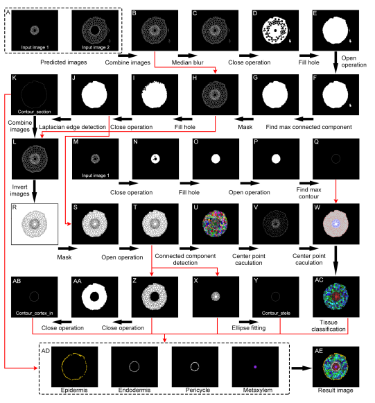

# AnatomyNet
# Introduction to AnatomyNet Software


# AnatomyNet Software

AnatomyNet is a software developed using OpenCV and PaddlePaddle for processing slice images. Version 1.0 provides training weights for root segmentation and related code for root trait extraction. The UI is developed using PYQT, making it simple and easy to use with strong expandability. In the future, we will provide different trait extraction codes for different types of slice images. The software also has an integrated deep learning training interface. Users can quickly generate label data for training based on their own data and the annotation production method we provide to achieve targeted weight design.


You can download the weight file form https://drive.google.com/drive/folders/19hvajeDV6yosTYnLGwVMcZseJsKvYhn_?usp=drive_link


Please check the versions of CUDA and cuDNN installed on your computer, and visit the PaddlePaddle official website to select and install the compatible Paddle version. It is recommended to use a conda virtual environment. After installation, install the required dependencies listed in requirements.txt, and then run Main.py to start using the software.


# User Interface

The interface is mainly divided into four parts. The upper-left and upper-right are the image display windows, including the original image and the processed image. The lower-left area is the function area. The current version provides three functions: deep learning segmentation (based on AnatomyUNet), root trait extraction, and deep learning network training. The lower-right area is the processing display area, which updates the current processing status in real-time.


## Usage

### Deep Learning Segmentation

The purpose of this function is to segment the edge of the stele and cortex in root section slices, in preparation for the second step of trait calculation. The network model used is DeepLab v3+. The specific steps are:

1. Click "Input file path" to select the image path. Ensure that only image files are in the folder.
2. Click "weight path" to select the deep learning weight file. You can choose the one we provide.
3. Select "Class number". The number of classes is the number of categories for segmentation plus one (background). If distinguishing between stele and cortex, the number of categories is 3.
4. Click "Predict image save path" to select the result save path.
5. Finally, click "Start SEG" to start segmentation. The text box on the right will show the working status in real-time. The two image display areas above will show the input image and the segmented image.
6. Two file folder, "in" and "out", will be generated for the segmented stele and cortex, respectively. The size and name of the output files will be identical to the input file.


## Root Trait Extraction

1. Click "Choose image path". The path has strict requirements. Two folders named "in" and "out" will be generated based on the deep learning segmentation results. These folders store the segmentation results of the stele and cortex, respectively, with identical file names. Select the root directory where "in" and "out" are stored.
2. Click "Result save path" to select the path for the calculation results.
3. Nine parameters were entered to ensure the classification of the cells, namely, pericycle, endodermis, and epidermis. The software provides default values, which can be modified based on the default values.
4. Click "Start processing" to start processing.


## Model Training

1. Click "Choose label data" to select the training data. The training data must meet specific file format requirements. As shown in the figure, two files named "test" and "train" are required, which store the training data and the data set used for verification during training, respectively. In the subdirectory of the two folders, there is a "label" folder to store the label map and the original image "org". In addition to the two folders, there are three txt files in the root directory. The "labels" file contains the names of the categories, with the first line being the background, and the following lines defined by the user. It is worth noting that the pixel values of each class in the label start from 0, with the pixel value of the first class being 0, the second class being 1, and so on. The "train.txt" and "test.txt" files record the paths of the original image and label, with each line representing a pair of paths separated by a space.
2. Click "Weight save path" to select the path for saving the weight and training log. The log can be parsed using Paddle's official document: [https://www.paddlepaddle.org.cn/documentation/docs/en/develop/api_cn/io_cn/logger_cn.html](https://www.paddlepaddle.org.cn/documentation/docs/en/develop/api_cn/io_cn/logger_cn.html)).
3. Set "Epoch number", which is the number of training epochs. The larger the number, the longer the training time and the better the performance of the model.
4. Set "Batch size", which is the number of samples trained in each batch. The larger the number, the faster the training speed and the more memory required.
5. Set "Learning rate", which is the learning rate of the optimizer. The specific value needs to be adjusted according to the data characteristics and the network structure used.
6. Finally, click "Start Training" to start training. The training progress will be displayed in the text box on the right in real-time. After the training is completed, the trained weight file will be saved to the selected path.


# **Technical Methods**

In this section, we will introduce the image processing workflow used in this paper for rapid label creation and trait extraction. At the same time, we will make all the code public for users to adjust according to their own data or to improve the code.

## Image Processing Method (Rapid Label Generation)

In this section, we will introduce the image processing method used in this paper for rapid label generation. The main purpose of using deep learning is to enhance the robustness of the algorithm, enabling it to adapt to images under different lighting conditions and of different photo qualities. Traditional image processing methods can completely handle the extraction of traits like these root slice sections, but this paper uses a high-throughput root slice method developed independently. The large amount of data reduces the robustness of traditional image processing methods and makes it impossible to accurately segment root slices in batches. Semantic segmentation with deep learning can greatly reduce the difficulty of improving algorithm robustness. However, making labels is very time-consuming and laborious. Therefore, we thought of using image processing to assist in generating labels. By manually adjusting parameters and manually correcting, we independently generate a batch of labels for training, allowing it to adapt to different scenarios and data, thereby achieving the purpose of high-throughput trait extraction.

We will interpret the specific source code below, and users can get some inspiration to design their own image processing workflow.

1. [SegWithoutDL.py](http://segwithoutdl.py/) is a python file specifically used to generate label data. It can be found in the source code we submitted. First, use OpenCV to import pictures in grayscale. Users can also choose the grayscale channel they use. The standard for selection is to make the target to be segmented more prominent in the whole picture. Set two segmentation thresholds, one is the threshold for segmenting the entire slice section, and the other is the threshold for segmenting the stele part. Instantiate the processing class.

```python
img_org = cv.imread('data/1.jpg', 0)
# Adjust these two parameters to separate the entire slice and stele area of the image
seg_thresh_section = 20
seg_thresh_stele = 60
SegWithoutDL = SegWithoutDL(img_org, seg_thresh_section, seg_thresh_stele)
```

1. Image preprocessing, the main purpose is to enhance the target and separate the stele and cortex parts.

```python
def preprocess(self):
    img_pro = cv.medianBlur(self.img_org, 3)
    # Divide the section area first
    _, thresh_img_section = cv.threshold(img_pro, self.seg_thresh_section, 255, cv.THRESH_BINARY)
    thresh_img_section = open_demo(thresh_img_section)
    thresh_img_section = FillHole(thresh_img_section)
    thresh_img_section = Find_max_region(thresh_img_section)
    self.mask_section = get_mask(img_pro, thresh_img_section)

    # Divide the stele area
    _, thresh_img_stele = cv.threshold(self.mask_section, self.seg_thresh_stele, 255, cv.THRESH_BINARY)
    thresh_img_stele = FillHole(thresh_img_stele)
    thresh_img_stele = Find_max1. _region(thresh_img_stele)
    self.mask_stele = get_mask(img_pro, thresh_img_stele)

    self.mask_cortex = cv.subtract(self.mask_section, self.mask_stele)
```


1. The main steps including median filter: effectively removing noise in the image, denoising and other image enhancement operations, users can modify it again according to actual needs. First find the section in the image, remove other impurities, we default that the section in the whole image is the largest area. First use the threshold set before for threshold segmentation, and then use the **open operation**, **hole filling**, **and find the largest connected component** to determine the position of the section, and finally mask the section from the original image. Similarly, for the clean section image masked out, use threshold segmentation for secondary segmentation. This value was also set before instantiation. Fill the segmented image, find the largest connected area, and mask it to separate the stele area. The mask of the entire section area minus the stele mask can obtain the cortex mask. At this moment, we have obtained the masks of the cortex and stele. The next step is to segment the cell walls in each area as completely as possible. Histogram equalization can effectively adjust global grayscale, aiding in cell wall segmentation. At the same time, the use of the adaptive threshold method is crucial. Here, we may need to adjust the last two values according to our own data. The first is the size of the local neighborhood, and the second is the offset adjustment amount. You can adjust it up and down appropriately to observe the segmentation results. Finally, remove small connected areas of a certain size, and you can get the final binary images of the cell walls in the stele and cortex parts.

```python
# Segmentation of stele
gray_lap_stele = cv.equalizeHist(self.mask_stele)
# Adjust the adaptive parameters
gray_lap_stele = cv.adaptiveThreshold(gray_lap_stele, 255, cv.ADAPTIVE_THRESH_MEAN_C, cv.THRESH_BINARY, 15, -5)
gray_lap_stele = remove_small_objects(gray_lap_stele, 100)
```


## Image Processing Method (Trait Calculation)



The relevant code for trait calculation is for the binary images of the stele and cortex that have been segmented.

1. **Generation of complete section image:** The initial segmentation image was constructed by combining the deep learning-predicted stele cell wall segmentation and cortex cell wall segmentation. A median filter was applied to reduce noise, followed by a morphological closing operation and hole filling to merge meaningful but disconnected regions, yielding a more complete tissue area. To remove elongated artifacts attached to the section boundary, a morphological opening was applied. The largest connected component was then extracted to generate a binary mask of the section.

2. **Section area closure:** The binary mask was used to filter the full segmentation image , resulting in a clean cross-sectional cell wall image. Hole filling and morphological closing  were further performed to ensure a fully enclosed section area. The Laplacian operator was then applied to image to detect the outermost contour of the section, denoted as Contour_section. This contour was overlaid with the segmented image to reconstruct a more continuous and closed section image, effectively mitigating detection errors caused by broken outer edges.

3. **Cell detection and initial classification:** Image was inverted and combined with the section mask to identify individual cell regions. A morphological opening operation was applied to remove slender impurities and separate tightly adhered cells. All individual cells were then segmented using connected component analysis and the watershed algorithm. For classification, the centroid coordinates of each cell were computed. Cells whose centroids fell within the stele region were initially classified as stele cells, and the rest as cortex cells. An ellipse was fitted to the contours of all stele cells, defining the Contour_stele. A secondary refinement was performed: cells initially within the stele but located outside this fitted ellipse were reclassified as cortex cells, while the rest remained stele cells. This yielded a refined classification result.

4. **Cortex region boundary definition:** To define the inner boundary of the cortex, the cortex cell region was subjected to a morphological closing operation to merge all cortex cells into a single component. The largest inner contour within this region was extracted and defined as Contour_cortex_in, providing a reliable reference for layer-specific classification within the cortex.

5. **Cell type assignment and trait calculation**: The individual area of each cell was calculated. In the stele region, cells with area larger than stele_area_aver + 4 × stele_area_std were classified as metaxylem. For other stele cells, the shortest distances from each cell’s contour and centroid to Contour_stele were computed. Based on thresholds of area, contour distance, and centroid distance, pericycle cells were identified. Similarly, for cortex region cells, distances from both the contour and centroid to Contour_section and Contour_cortex_in were calculated. Based on five threshold conditions (area and four distances), cortex cells were further classified into endodermis, epidermis, and general cortex cells. The final result presents a complete cell-type segmentation and classification map for quantitative anatomical trait analysis. 
    
    **Criteria for Metaxylem Identification:**
    
    The cell's area is greater than the average area of the stele plus four times the standard deviation of the stele area.
    
    **Criteria for Pericycle Identification:**
    
    The pericycle needs to satisfy three criteria, specifically, to classify the cell,  the shortest distance from the cell's contour to the contour of the stele must be less than a set threshold (DS_threshold1), ensuring the cell's proximity to the stele region DS_threshold1; the shortest distance from its center to the contour of the stele must be less than the set threshold (DS_threshold2); the area of this cell must be less than the set threshold (Area_threshold).
    
    **Criteria for Endodermis** **Identification:**
    
    The Endodermis needs to satisfy three criteria, specifically, to classify the cell,  the shortest distance from the cell's contour to the inner contour of the cortex region the shortest distance from the cell's contour to the contour of the stele must be less than a set threshold (DS_threshold1), indicating that the cell is located close to the cortex boundary.ensuring the cell is located close to the stele region DS_threshold1; the shortest distance from the cell's center to this inner cortex contour must also be less than another threshold (DS_threshold2), the shortest distance from its center to the contour of the stele must be less than the set threshold DS_threshold2; the area of this cell must be less than the set threshold (Area_threshold)Area_threshold.
    
    **Criteria for Epidermis Identification:**
    
    The Epidermis needs to satisfy three criteria, specifically, to classify the cell, the shortest distance from its contour to the contour of the section must be less than the set threshold (DS_threshold1); the shortest distance from its center to the contour of the section must be less than the set threshold (DS_threshold2); the area of this cell must be less than the set threshold (Area_threshold).
    

1. **Trait Calculation:** DLAnatomyArray provides two types of trait calculations: single connected component and cell. For a single connected component, such as the stele area and the entire section area, traits including The traits can be represented by the following: 
- `width`
- `height`
- `aspect_ratio`
- `area`
- `equi_diameter`
- `perimeter`
- `radius`
- `MA`
- `ma`

For the cell area, these traits are calculated for all cells, and the mean and standard deviation of cell area are calculated for cells with an area between the average area plus or minus two standard deviations. Additionally, the number of cells in the area and the number of fitted cells are computed.

$$
Cell_(number_fitting )=(AREA_all)/(Area_averager )
$$

The specific traits are as follows：

| Traits class | Class                           | Trait name | Explain |
| --- |---------------------------------| --- | --- |
| Cell | Stele                           | Number |  |
|  | Pericycle                       | Fitting number | Area/Mean cell area |
|  | Metaxylem                       | Area | The total area of all the cells |
|  | Endodermis                      | Width | The mean of the width of the minimum enclosing rectangle of all cells |
|  | Cortex                          | Standard deviation of width |  |
|  | Epidermis                       | Height |  |
|  | Endodermis + Cortex + Epidermis | Standard deviation of height | The mean of the height of the minimum enclosing rectangle of all cells |
|  | Stele + Pericycle + Metaxylem   | Aspect ratio | Width/Height |
|  |                                 | Standard deviation of aspect ratio |  |
|  |                                 | Equivalent circular diamete | The mean of the diameter of the equivalent circle of all cells |
|  |                                 | Standard deviation of
equivalent circular diamete |                                 |
|  |                                 | Perimeter | The mean of the radius of the minimum enclosing circle of all cells |
|  |                                 | Standard deviation of perimeter |  |
|  |                                 | Minimum enclosing circle radius |  |
|  |                                 | Standard deviation of minimum enclosing circle radius |  |
|  |                                 | The major axis of the fitting ellipse |  |
|  |                                 | Standard deviation of the major axis of the fitting ellipse |  |
|  |                                 | The minor axis of the fitting ellipse |  |
|  |                                 | Standard deviation of the minor axis of the fitting ellipse |  |
|  |                                 |  |  |
| Region | Stele region                    | Area |  |
|  | Entire section                  | Width |  |
|  |                                 | Height |  |
|  |                                 | Aspect ratio |  |
|  |                                 | Equivalent circular diamete |  |
|  |                                 | Perimeter |  |
|  |                                 | Minimum enclosing circle
  radius |                                 |
|  |                                 | The major axis of the fitting ellipse |  |
|  |                                 | The minor axis of the fitting ellipse |  |
|  |                                 |  |  |
| Ratio | Ratio                           | SWR | area of stele to whole root ratio |
|  |                                 | SCSAR  | area of stele cell to stele area ratio |
|  |                                 | CCCAR | area of cortex cell to cortex area ratio |
|  |                                 | WCWAR | area of whole cell to whole root section area ratio |
|  |                                 | SCR | area of stele to area of cortex ratio |
|  |                                 | SCCCR | area of stele cell to cortex cell area ratio |
|  |                                 | CNSNR | number of cortex cell to stele cell ratio |
|  |                                 | CFNSR | Fitting number of cortex cell to stele cell ratio |
|  |                                 | CFNSR | Fitting number of cortex cell to stele cell ratio |
